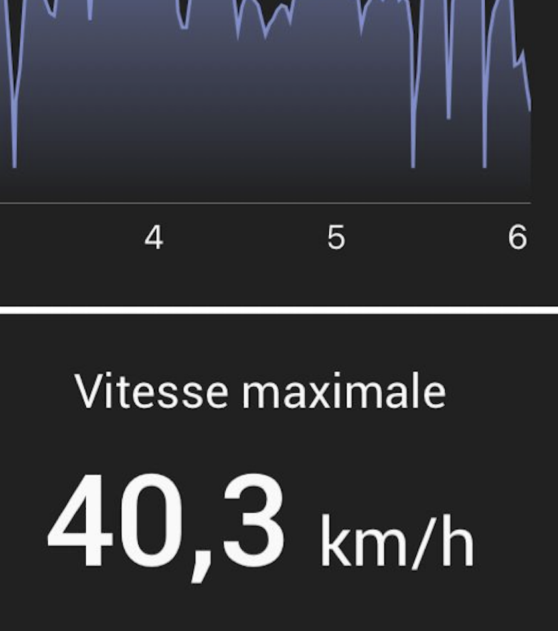
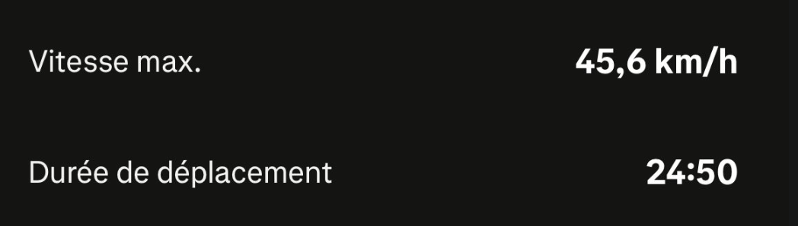

# Comment faire du vélo à Paris

Les Conseils, Les Règles, et Les Astuces 🧑‍🍳 pour faire du vélo à Paris en toute sécurité et avec plaisir.

  On commence ? <carbon:arrow-right />

---
layout: intro
---

# Qui suis-je ?

Je suis #Piyush, un fan de vélo mais ma mére toujours avait peur que j'aurai un accident avec le vélo (et elle avait raison, parce que j'ai eu un accident à vélo quand j'étais petit). Mais l'année dernière, j'ai décidé de faire du vélo sur le canal du midi, et depuis, j'accepte mon destin de faire du vélo.

---
layout: two-cols-header
---

# Purquoi faire du velo à Paris ?
> Paris compte aujourd'hui plus de **1 000 km** de pistes cyclables !

::left::
 
<v-click><h1>Bonnes raisons 🙂</h1></v-click>
<v-click>

 </v-click>
<v-click>
 - C'est écologique 
 </v-click>
<v-click>
 - C'est rapide
</v-click>
<v-click>
 - C'est économique
</v-click>
<v-click>
 - C'est bon pour la santé
</v-click>
::right::

<v-click class="text-lg">
 
<h1>Les raisons fun 💅 </h1>
<v-click>

 </v-click>
<v-click>
 - Tu ne besoin pas d'un permis de conduire 
</v-click>
<v-click>
 - Tu peux passer de limit des vitesses à 30 km/h
 </v-click>
<v-click>
 - Tu peux rouler dans sens unique mais en inversant le sens
 </v-click>
<v-click>
 - Tu peux acheter un café très cher pour flexer
 </v-click>
<v-click>
 - Tu peux joiner des groupes de vélo chez Strava comme les gens qui courant à pied (j'apprenais le mot "courant" grace à les gens de Hinge)
 </v-click>
</v-click>

---
layout: quote
---
je blague, ils sont interdits dans le code de la route, mais aussi c'est juste 750 euros max pour une amende, pas si cher que ça pour flexer.

---
layout: default
---
# Comment faire du vélo à Paris ?

Paris a plusieurs options pour faire de vélo, ils sont inclus les options de location, de acheter, et utiliser les vélos public.

1. **Vélib** — le système de vélo en libre-service. Tu as des stations dans toute la ville, et tu peux faire du vélo manuel ou électrique. 
**Le conseil de Piyush**: c'est ne functionne pas, et si tu habite dans un arr. qu'est très bobo, Velib' est comme un don à la ville, avec aucune cause :))

2. **Véligo** — un autre système public pour louer des vélos, mais ici tu gardes ton vélo, et ne retourne pas au station apres chaque trajet.  
**Le conseil de Piyush**: Les voleurs de Paris connaissent très bien voler ce vélo, bon chance de le garder ce vélo pour plus que 2 jours.

3. **Louer privé** — il y a beaucoup des entreprises privées qui louent des vélos, comme Jump, Lime, et Dott.  
**Le conseil de Piyush**: C'est plus cher que les options publiques, je ne prefere pas cette option parce que ce velo ne'est jamais à toi. 

---
layout: default
---

...continuer...

4. **Acheter un vélo** — tu peux acheter un vélo. Il y a nombreuses des options pas cher à Paris de acheter un velo. Si c'est ton premier fois, je recommande d'acheter un vélo d'occassion. Tu peux acheter un velo au moins cher que 100 euros.  
**Le conseil de Piyush**: C'est la meilleure option pour faire du vélo, apprendre le velo, et donner un sens de liberté. Il y a toujours un risque de vol mais c'est Paris, si tu a un peur de voler, tu peux prender un assurance pour ton velo.

Mais quand tu es prêt pour acheter un vélo de vitesse, vient à moi, je peux te recommander comment dépenser 10K euros sur un vélo de route :)) Je attends !
---
layout: two-cols-header
---

# Qu'est-ce que tu vois à Paris sur vélo ?

::left::

::right::

# Right

---
layout: quote
---
je blague
---
layout: image
image: images/beau.png
backgroundSize: contain
---
---
layout: image
image: images/show1.jpg
backgroundSize: contain
---
---
layout: image
image: images/show2.jpg
backgroundSize: contain
---
---
layout: final
class: text-center
---

# Conclusion

Le vélo à Paris, en France, c'est **pratique**, **rapide** et **agréable** !

 

**Alors, à vos vélos !** 🚲

 
 

*Merci de votre attention — pas des questions :)) aller acheter un vélo ! chop chop !*
